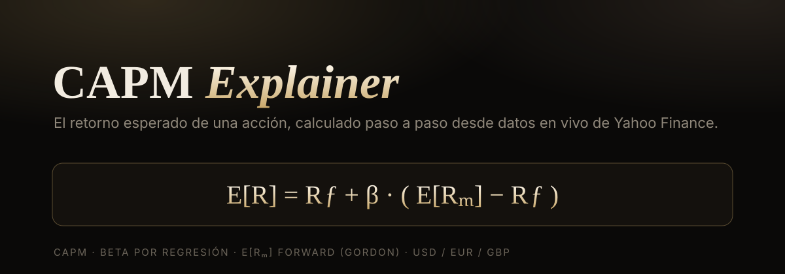

# CAPM Explainer

Una web que calcula, **paso a paso y de forma animada**, el retorno esperado de una acción con el modelo **CAPM** (Capital Asset Pricing Model), usando datos en vivo de Yahoo Finance.

Escribe el **nombre** o el **ticker** de una empresa (`Repsol`, `Apple`, `KO`, `Santander`…) y te enseña la fórmula, de dónde sale cada valor, y el resultado en porcentaje.



## Qué hace

Desglosa la fórmula del CAPM componente a componente, en vez de escupir un número:

> **E[R] = R_f + β · (E[R_m] − R_f)**

- **R_f** — tasa libre de riesgo: bono soberano a 10 años según la moneda (USD → `^TNX` en vivo; EUR/GBP → valor configurable).
- **β** — se **calcula por regresión** (cov/var) de los retornos mensuales de la acción frente al índice de su mercado. Muestra el **R²** para saber si la beta es fiable.
- **E[R_m]** — retorno esperado del mercado, **forward** (modelo de Gordon: `div_yield·(1+g) + g`), no media histórica.
- **Buscador por nombre**: resuelve `Repsol` → `REP.MC` automáticamente vía la búsqueda de Yahoo.
- **Mercados soportados**: EE. UU. (USD), Eurozona (EUR), Reino Unido (GBP).

## Cómo ejecutarlo

Requisitos: **Python 3**.

```bash
pip install -r requirements.txt
python server.py
```

Abre **http://localhost:8000** y escribe una empresa.

También funciona por línea de comandos:

```bash
python capm.py KO
python capm.py Repsol --g 0.05
```

## Cómo funciona

| Archivo | Rol |
|---|---|
| `capm.py` | El modelo: beta por regresión, R_f por moneda, E[R_m] por Gordon, y el buscador de tickers. |
| `server.py` | Servidor mínimo con la librería estándar de Python (sin dependencias). API `/api/capm?ticker=`. |
| `index.html` | La interfaz animada (KaTeX para las fórmulas), diseño "Neural Noir". Sin frameworks. |

## Limitaciones (con honestidad)

- **No es asesoramiento financiero.** Es una herramienta educativa.
- **E[R_m]** por Gordon da valores más conservadores (~5%) que la media histórica (~10%): las recompras hacen que solo el dividend yield lo infravalore. El parámetro `g` es ajustable.
- **R_f de EUR/GBP** es un valor por defecto (Bund/Gilt) que puedes sobrescribir; Yahoo no publica bonos europeos.
- Algunos valores tienen **datos ruidosos** en Yahoo (baja correlación con el mercado). En esos casos la app **avisa** de que la beta es poco fiable (R² bajo) en vez de dar un número falso.
- `yfinance` puede recibir límites de Yahoo (error 429) si se llama muchas veces seguidas.

## Stack

Python (`http.server` de la stdlib + `yfinance` + `numpy`), HTML/CSS/JS vanilla, [KaTeX](https://katex.org/).

## Licencia

MIT — úsalo, modifícalo y compártelo libremente.
